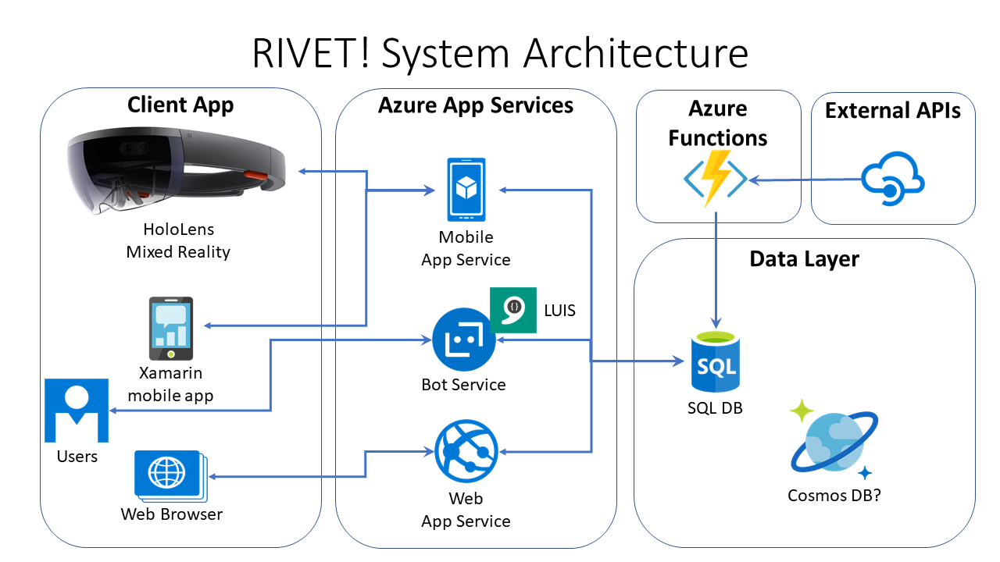

# RIVET: Related Info Viewer... with Extra Things!

**Scenarios**

*Business Application*
- Visualize team members in organization, e.g. CSE
- Get related projects or member info, e.g. Are person A and person B on the same team?
- Get internal info, e.g. Office365
- Get external info, e.g. LinkedIn

*Entertainment Application*
- Visualize movies in a cinematic universe, e.g. Marvel, DC
- View movie info in order of release, chronological order, etc
- View actor profiles and related info, e.g. how many movies do Iron Man and Hulk appear together
- Get external info, e.g. MovieDB

**Web App**

*Technologies Used*
- ASP .NET Core 2.1
- MVC, Razor Pages, SignalR
- Entity Framework Core
- Visual Studio 2017, C# and .NET Core

*Purpose*
- Create, edit, delete, view hierarchical/related items in DB

**Mobile App**

*Technologies Used:*
- Xamarin
- Cognitive Services (e.g. Computer Vision API)
- Visual Studio 2017, C# and .NET

*Purpose*
- Capture camera image to identify items stored in DB

**Bot Framework Chatbot**

*Technologies Used:*
- Bot Framework v4
- LUIS
- Visual Studio 2017, C# and .NET

*Purpose*
- Let users query the system via voice or text 

**HoloLens App**

*Technologies Used:*
- HoloLens headset
- Unity, Visual Studio, C# and .NET
- Cognitive Services (e.g. Computer Vision API)

*Purpose*
- Interact with hierarchical/related data in mixed reality 
- Capture camera image to identify items stored in DB

**Azure Function App**

*Technologies Used:*
- Azure Functions, scheduled or triggered on demand 
- Visual Studio, C# and .NET
- Visual Studio Code (optional)

*Purpose*
- Get data via external APIs, then store in RIVET system DB

